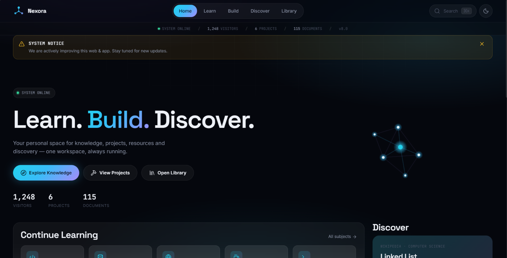

# Desktop
Homepage of profile that show all projects &amp; resources.
# 🌌 NEXORA — Learn. Build. Discover.

**NEXORA** is my personal web portal where I keep my projects, learning resources, experiments, and useful links in one place.

It is built around three simple ideas:

> **Learn something. Build something. Discover something new.**

🌐 **Live Website:** https://kishan741i.github.io/NEXORA/

---

## ✨ What is NEXORA?

NEXORA is more than a portfolio. It's a small digital space where I can share what I'm learning, the things I'm building, and the ideas I'm exploring.

  

### 📚 Learn

An **E-Library** for study materials, practical files, notes, PYQs, and other useful resources.

### 🛠️ Build

A collection of my projects, websites, and experiments, with live previews for selected projects.

### 🔭 Discover

A place for trying new technologies, UI ideas, animations, and creative web experiments.

---

## 🚀 Features

* 📚 Integrated E-Library with search and categories
* 🛠️ Project showcase with live previews
* 🌌 Glassmorphic dark UI
* ✨ Interactive particle background
* 🌺 Animated 3D Red Spider Lily scene
* 🎵 Ambient background music
* 🔗 Useful learning and development links
* 📱 Responsive design for different devices
* 📊 Visitor counter

---

## 🛠️ Built With

NEXORA is mainly built using **HTML, CSS and Vanilla JavaScript**, along with **Font Awesome**, **Canvas**, and **Three.js** for the interactive visual experience.

The project is hosted using **GitHub Pages**.

---

## 📂 Projects

Some projects currently featured in NEXORA include:

* **Career Navigator** — Helps students explore courses and career options.
* **Habit Tracker Pro** — A simple tool for managing daily habits.
* **Notes Application** — A clean web-based notes application.
* **News Portal** — A dynamic platform for displaying news.

---

## 🗺️ What's Next?

NEXORA is still growing. Future plans include better resource discovery, more projects and experiments, an AI assistant, voice navigation, and further improvements to performance and security.

---

## 👤 About

NEXORA is created and maintained by **[kishan741i](https://github.com/kishan741i)** as a personal project and learning space.

If you find it useful or simply like the idea, feel free to ⭐ the repository.

---

### 🌌 NEXORA

**Learn · Build · Discover**

*© 2026 NEXORA*

